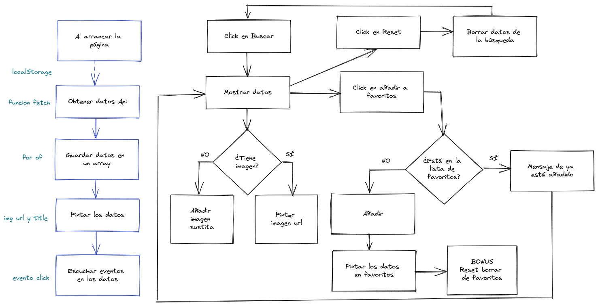

# Módulo 2: Ejercicio de Evaluación final    

El ejercicio consiste en desarrollar una aplicación web de búsqueda de series de anime, que nos permite marcar las series como favoritas y guardarlas en el local storage.

Para probarlo haz click  [aquí](http://beta.adalab.es/modulo-2-evaluacion-final-PatriMalvido/) y verás el **PatriAnime** en funcionamiento.  

-------------------------------------------

## Descripción y pasos del ejercicio :spiral_notepad:

Los requisitos que me pidieron para la aplicación web son:
  #### Buscar

 - Búsqueda: al hacer click sobre el botón de Buscar la aplicación debe conectarse al API abierto de Jikan para la búsqueda de series de anime. 
 - Por cada serie contenido en el resultado de la búsqueda hay que pintar una tarjeta donde mostramos una imagen de la serie y el título.
 - Algunas de las series que devuelve el API no tienen imagen. En ese caso hay que mostrar una imagen de relleno.

#### Favoritos

 Una vez aparecen los resultados de búsqueda, la usuaria puede indicar cuáles son sus series favoritas. Para ello, al hacer clic sobre una serie debe pasar lo siguiente:
 - El color de fondo y el de fuente se intercambian, indicando que es una serie favorita.
 - Hay que mostrar un listado en la parte izquierda de la pantalla, debajo del formulario de búsqueda,con las series favoritas.
 - Las series favoritas deben seguir apareciendo a la izquierda aunque la usuaria realice otra búsqueda. 

 #### Almacenamiento local

 Hay que almacenar el listado de favoritos en el localStorage. De esta forma,al recargar la página el listado de favoritos se debe mostrarse.

 #### BONUS: borrar favoritos

Poder añadir/quitar como favorito al hacer clic sobre una serie del lado de la derecha. Y que, si realizamos una nueva búsqueda y sale una serie que ya es favorita, aparezca ya resaltada en los resultados de búsqueda (con colores de fondo y texto intercambiados)y un botón para borrar todos los favoritos a la vez.

### Diagrama de flujo

Para el planteamiento del ejercicio realicé un diagrama de flujo para tener como guía para los pasos a seguir para la parte de código de JavaScript.

----------------------------------------------------
## Construido con: :gear: :hammer_and_wrench:

He usado el Starter Kit de Adalab, creado en Node y Gulp, que es una plantilla de proyecto con funcionalidades preinstaladas y preconfiguradas. 
Este Kit incluye un motor de plantillas HTML, el preprocesador SASS y un servidor local y muchas cosas más. El Kit nos ayuda a trabajar más cómodamente, nos automatiza tareas.

------------------------------------------------------

## Maquetación :art:

Los botones tienen transiciones para un mejor efecto visual. He añadido fondos con degradados y como guinda del pastel, he creado un logo con el nombre de mi aplicacion y una imagen.
La aplicación tiene diseño responsive para móvil, tablet y desktop. 

----------------------------------------------------------------

## Licencia  📄 

Este proyecto está bajo la Licencia MIT License mira el archivo [LICENSE](LICENSE) para más detalles

-------------------------------------------------------
## Autora: :woman_technologist:

Futura junior frontend developer **Patri Malvido** [Github](https://github.com/PatriMalvido)
